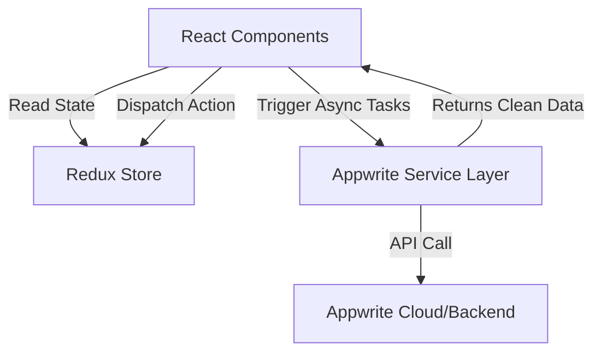

# Redux State Management vs. Service Architecture Analysis

This document provides a detailed architectural review of the project's data flow, explaining why API/database logic is kept separate from Redux, how Redux should be used in production, and identifying structural bugs in the current implementation.

---

## 1. Where are the Service Methods Located?
In this project, API and backend logic is abstracted into two service files inside the `src/appwrite/` directory:
1. **Authentication Service**: [auth.service.js](file:///D:/3_Learning/Unstoppable/ReactChaiAurCode/12MegaBlog/src/appwrite/auth.service.js)
   - Manages user creation, login, session validation, and logout.
2. **Database & Storage Service**: [config.js](file:///D:/3_Learning/Unstoppable/ReactChaiAurCode/12MegaBlog/src/appwrite/config.js)
   - Manages CRUD operations for posts (create, read, update, delete) and media file operations (upload, delete, preview).

---

## 2. Why Not Implement Appwrite Methods in Redux?

Putting API network calls directly inside Redux violates core software engineering principles:

### A. Separation of Concerns (SoC)
* **Redux** is a **Global State Management** library. Its sole responsibility is to store and distribute data across components, and manage how the client-side state changes over time.
* **Appwrite Services** act as the **Data Access Layer (API Client)**. Their sole responsibility is to talk to Appwrite, configure endpoint settings, handle network protocols, and map backend responses.
* Keeping them separate ensures that components only worry about *what* data to display, Redux only worries about *where* it is stored, and services only worry about *how* to fetch it.

### B. Prevention of State Contamination
Redux state must be **serializable** (i.e., plain JS objects, arrays, and primitives that can be converted easily to JSON).
* Appwrite SDK classes (like `Client`, `Account`, `Databases`, `Storage`) contain network socket references, internal state, and methods.
* If you instantiate these inside Redux slices or store, you pollute the state with non-serializable objects. This breaks Redux DevTools, time-travel debugging, and state serialization.

### C. Reducer Purity
Reducers in Redux must be **pure functions**:
$$\text{state} + \text{action} \rightarrow \text{new state}$$
* They must not perform side effects (no network requests, no database updates, no asynchronous actions, no random number generation).
* Putting async Appwrite calls directly inside standard Redux reducers is physically impossible because they return Promises rather than immediate state updates.

### D. Vendor Independence (Flexibility & Scalability)
* If your database calls are tightly coupled inside Redux, switching to another backend provider (e.g., Firebase, Supabase, or a custom Node.js Express server) would require rebuilding your state management layer entirely.
* With a **Service Layer**, you can swap Appwrite with Firebase by editing only `auth.service.js` and `config.js` while keeping the method names (like `login`, `logout`, `createPost`) identical. Redux and your UI components will work without changing a single line of code!

---

## 3. What Problems Would We Face if We Wrote Methods in Redux?

1. **Massive Boilerplate & Cluttered Store**:
   For every single asynchronous call (e.g., deleting a post, fetching a file preview), we would need to write three actions (pending, fulfilled, rejected) using Redux Toolkit's `createAsyncThunk`. This balloons the codebase and makes store files unreadable.
2. **Unnecessary Global Re-renders**:
   Not every database operation needs to be tracked globally. For example, uploading a temporary file or retrieving a preview URL is a localized operation. If we store these in Redux, every file upload will trigger global state updates, causing unrelated components to re-render.
3. **Harder Testing and Debugging**:
   Testing UI logic and testing backend API integration become inseparable. You cannot test your API calls in isolation without setting up a mock Redux store.

---

## 4. Redux in Production: What to Put There?

In a production-ready application, Redux should store **global, shared, and client-side UI states**.

| What Belongs in Redux | What Belongs in Separate Services |
| :--- | :--- |
| **Authentication Session**: Current user details, login status (`isLoggedIn`). | **Network Request Execution**: Making `fetch`/SDK calls to login/logout. |
| **Global Theme / UI Config**: Dark/light mode, sidebar navigation status. | **File Storage Handling**: Uploading binary blobs, deleting files from bucket. |
| **Shared Application Cache**: Post list needed by multiple distinct UI components. | **Database CRUD**: Fetching specific rows, sending updates to collection. |
| **Global Notification / Toast Queue**: Triggering alerts from anywhere. | **Third-party SDK Initializations**: Storing endpoints and project IDs. |

### Production Redux Best Practices:
1. **Use RTK Query for Async State**: Instead of writing manual thunks for server data (posts, files), production apps use **RTK Query** (built into Redux Toolkit). It auto-generates hooks like `useGetPostsQuery()`, handles caching, refetching, pagination, and invalidation automatically.
2. **Normalize State**: Store complex collections as normalized dictionaries (ID-to-Object mapping) using `createEntityAdapter` to avoid nested array lookups.
3. **Selector Optimization**: Use memoized selectors (`createSelector`) to prevent unnecessary component re-renders when reading sub-states.

---

## 5. Did This Project Use the Correct Approach?

**Conceptually, Yes!**
* Using an ES6 Class syntax with constructor-based initialization (`new Client()`) and exporting a default instantiated singleton (`const authService = new AuthService(); export default authService;`) is the standard, cleanest architectural pattern.
* In [App.jsx](file:///D:/3_Learning/Unstoppable/ReactChaiAurCode/12MegaBlog/src/App.jsx#L12-L22), the component fetches data asynchronously via the service and only dispatches the result to Redux:
  ```javascript
  authService.getCurrentUser()
    .then((userData) => {
      if (userData) dispatch(login({ userData }))
      else dispatch(logout())
    })
  ```
  This is the correct approach. Redux remains a lightweight, reactive store, while Appwrite handles the heavy lifting in the background.

---

## 6. What Did We Do Wrong? (Critical Bugs Identified)

While the *architectural approach* is correct, the implementation in `src/appwrite/config.js` has several severe runtime bugs that will crash the application:

### A. Missing Import & Reference Error
On [config.js:L14](file:///D:/3_Learning/Unstoppable/ReactChaiAurCode/12MegaBlog/src/appwrite/config.js#L14):
```javascript
this.databases = new Databases(this.client);
```
* **The Bug**: `Databases` is never imported from the `"appwrite"` package on line 2 (which only imports `Client, ID, TablesDB, Storage, Query`).
* **The Result**: Calling `new Service()` will throw a `ReferenceError: Databases is not defined` and crash the initialization.

### B. Undefined Property Usage (`this.TablesDB`)
Throughout `config.js` (lines 21, 41, 59, 73, 86):
```javascript
return await this.TablesDB.createRow({ ... })
```
* **The Bug**: `this.TablesDB` is never declared, initialized, or bound to the service instance. The constructor initializes `this.databases` (which itself fails due to the missing import).
* **The Result**: Calling any method like `createPost` will throw `TypeError: Cannot read properties of undefined (reading 'createRow')`.

### C. Incorrect SDK Method Names
Appwrite uses standard method names for database operations on the `Databases` class. The current code uses incorrect mock method names:

| Code Method Used | Correct Appwrite SDK Method |
| :--- | :--- |
| `TablesDB.createRow` | `databases.createDocument` |
| `TablesDB.updateRow` | `databases.updateDocument` |
| `TablesDB.deleteRow` | `databases.deleteDocument` |
| `TablesDB.getRow` | `databases.getDocument` |
| `TablesDB.listRows` | `databases.listDocuments` |

*Additionally, on line 76 of `config.js`, the argument is named `documentId: slug`, but on lines 24 and 44 it is named `rowId: slug`. The correct Appwrite SDK parameters use `documentId`.*

---

## Summary of Architectural Flow


